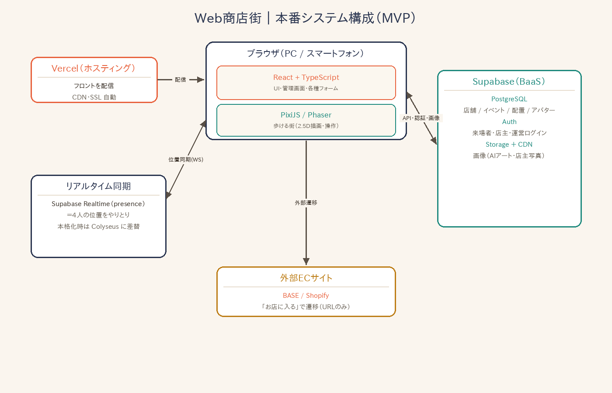

# Web商店街 — 要件定義（開発版・ドラフト）

オンライン商店街サービス「Web商店街」を本開発する場合の要件メモ。
※ 現状の `web-shotengai/` 配下はデザインモック。本書は「製品化する場合」の要件。

---

## 1. サービス概要
- ユーザーがアバターを操作して **2.5Dの街（マーケット）を回遊**し、お店に近づくと紹介ウィンドウが出て、**BASE / Shopify の外部ECへ遷移**する。
- 友人数名（目安4人）で同時に入り、Discord等で通話しながら一緒に回るイメージ（チャット・ボイスは実装しない）。
- 街（マーケット）は **イベントごとに作成**でき、世界観テーマ（春マルシェ / 夏祭り / ハロウィン / 雪まつり 等）を切り替えられる。

## 2. ロールと権限

| ロール | 概要 | 主な権限 |
|---|---|---|
| **一般ユーザー** | 会員登録して街を回遊する来場者 | マーケット入場・回遊、アバター設定、お気に入り、ECへ遷移 |
| **店舗ユーザー** | マーケットに出店するお店のオーナー | 自店の登録・編集、建物デザイン選択、商品写真、ECリンク設定、公開/非公開、簡易分析 |
| **管理者（運営）** | プラットフォーム全体の運営 | マーケットの作成・編集、店舗ユーザー/店舗の審査・管理、配置、一般ユーザー管理、アセット管理、通報対応 |

## 3. データ構造（関係）

```
管理者(admin) ──< マーケット(Market) ──< 店舗(Shop) >── 店舗ユーザー(ShopUser)
                                   └─< 商品写真(ProductImage)
一般ユーザー(User) ──< 来訪/お気に入り >── マーケット/店舗
一般ユーザー(User) ──1 アバター(Avatar)
```

- **マーケット(Market)**：管理者が複数作成。属性＝名称 / 世界観テーマ / 開催期間 / 公開状態 / 最大店舗数 / 街レイアウト。
- **店舗(Shop)**：1マーケットに複数。`market_id` と `owner(店舗ユーザー)` に紐づく。属性＝店名 / カテゴリ / 紹介 / 建物デザイン / 看板 / SNS / ECリンク(BASE/Shopify) / 公開状態 / 配置(区画)。
  - 1人の店舗ユーザーが**複数マーケットに出店**することも可（Shop が market_id を持つ）。
- **一般ユーザー(User)**：会員。1つのアバター、複数のお気に入り・来訪履歴。

---

## 4. 画面一覧

### 4-0. 共通 / 認証

| # | 画面 | 説明 |
|---|---|---|
| C1 | サービス紹介(LP) | サービス概要・開催中マーケット導線 |
| C2 | 会員登録（一般） | メール+パスワード / SNSログイン |
| C3 | ログイン | ロール共通 or ロール別入口 |
| C4 | パスワード再設定 | 再設定メール送信 → 新パスワード |
| C5 | メール認証 | 登録確認 |
| C6 | 利用規約 / プライバシーポリシー | 規約表示 |
| C7 | エラー / メンテナンス | 404・503 等 |

### 4-1. 一般ユーザー

| # | 画面 | 説明 |
|---|---|---|
| U1 | マーケット一覧 | 開催中・予定の街を選ぶ |
| U2 | マーケット詳細 / 入場 | 概要・出店一覧・「入場する」 |
| U3 | **街マップ（歩く街）** | 本体。アバターで回遊、他ユーザー位置表示、全画面 |
| U4 | お店紹介ウィンドウ | 近づくと表示（商品サムネ・紹介・ECボタン・お店に入る） |
| U5 | 店舗詳細ページ | お店の情報・商品写真・SNS・EC遷移 |
| U6 | お店一覧 / 検索 | カテゴリ・キーワードで探す |
| U7 | アバター選択・カスタマイズ | テンプレ選択・表示名 |
| U8 | マイページ | プロフィール・来訪履歴・お気に入り |
| U9 | お気に入り一覧 | 保存した店 |
| U10 | お知らせ / 通知 | 運営からの通知・イベント告知 |
| U11 | アカウント設定 | メール/パスワード・通知設定・退会 |

### 4-2. 店舗ユーザー

| # | 画面 | 説明 |
|---|---|---|
| S1 | 店舗ユーザー登録 / 申請 | 出店者アカウント作成（承認制を想定） |
| S2 | ログイン | 店舗ユーザー用 |
| S3 | 出店申請 | どのマーケットに出すか申請（審査） |
| S4 | ダッシュボード | 自店の来訪数・ECクリック数・公開状況 |
| S5 | 店舗情報編集 | 店名・カテゴリ・紹介・SNS・ECリンク(BASE/Shopify) |
| S6 | 建物デザイン選択 | 用意された建物アートから選ぶ（テンプレ） |
| S7 | 商品・店内写真管理 | 紹介ウィンドウ/詳細に出す画像をアップ |
| S8 | 公開設定 | 公開 / 下書き（非公開） |
| S9 | 配置の確認 | 街での自店の位置（区画は運営割当 or 申請） |
| S10 | 分析 | 来訪・ECクリックの推移 |
| S11 | プラン / 請求 | 出店料・支払い（収益化する場合） |
| S12 | 店舗アカウント設定 | 担当者情報・通知 |

### 4-3. 管理者（運営）

| # | 画面 | 説明 |
|---|---|---|
| A1 | 管理ログイン | 運営用 |
| A2 | 運営ダッシュボード | 全体KPI（マーケット数・店舗数・来場・売上） |
| A3 | マーケット一覧 | 全マーケットの状態 |
| A4 | マーケット作成 / 編集 | 名称・世界観テーマ・期間・最大店舗数・公開設定 |
| A5 | 街レイアウト / 配置管理 | 各マーケットの店舗配置（区画割当） |
| A6 | 店舗ユーザー（出店者）管理 | 一覧・承認/却下・詳細 |
| A7 | 店舗管理（横断） | 全店の一覧・審査・公開停止 |
| A8 | 一般ユーザー管理 | 一覧・詳細・制限/凍結 |
| A9 | アセット管理 | 建物・アバター・地面・小物テンプレの登録 |
| A10 | お知らせ配信 | 通知/バナーの作成・配信 |
| A11 | 通報 / モデレーション | 不適切コンテンツの対応 |
| A12 | 売上 / 請求管理 | 出店料・入金状況（収益化する場合） |
| A13 | 運用監視 | 同時接続・稼働・インフラ状況 |
| A14 | 運営メンバー / 権限設定 | 管理者の追加・権限 |

> 画面数目安：共通7 / 一般11 / 店舗12 / 管理14 ＝ **約44画面**（MVPでは絞り込み可能。例：請求・分析・モデレーションは後回し）。

---

## 5. 技術スタック（MVP）

| 層 | 採用 | 備考・代替 |
|---|---|---|
| 街の描画 | **PixiJS**（or Phaser 3） | 2.5Dスプライト描画。現モックの規格（接地点=下端中央・タイル・スプライト合成）を流用 |
| UI / 管理画面 | **React + TypeScript + Vite** | 代替: Next.js / Vue |
| スタイル | Tailwind CSS | — |
| 同時接続(4人) | **Supabase Realtime（presence）** | 位置配信のみ。本格化時 **Colyseus**（ルーム=マーケット） |
| DB / 認証 / 保存 | **Supabase**（PostgreSQL + Auth + Storage） | バックエンド開発を最小化。代替: Firebase / 自前Node+PostgreSQL |
| 画像 / アセット | Supabase Storage（+CDN） or Cloudflare R2/Images | AIアート・アバター・店主アップ画像（自動リサイズ） |
| EC連携 | URL保存→外部遷移のみ | BASE/Shopify のAPI連携は不要 |
| ホスティング | **Vercel** | CDN・SSL自動。代替: Cloudflare Pages / Netlify |
| 認証ロール | Supabase Auth + ロール(RLS) | 一般 / 店舗 / 管理者を Row Level Security で制御 |

### コストを抑えられる理由
- **チャット/ボイス不要**（Discord前提）→ WebRTC/音声インフラ不要
- **同時4人**＝負荷極小、専用ゲームサーバ不要（pres-enceで十分）
- **EC＝外部リンク**＝決済・在庫・物流の実装ゼロ
- **マネージド構成（Vercel + Supabase）**で運用工数が小さい

## 6. システム構成図



## 7. インフラ / 非機能（仕様対応）
- **サーバー構築** → Vercel + Supabase のマネージド
- **ドメイン** → レジストラ取得 → Vercel割当
- **SSL** → 自動発行・更新
- **バックアップ** → Supabase(Postgres) 自動バックアップ
- **同時接続** → MVPは数名/マーケット（presence）。スケール時 Colyseus
- **対応端末** → PC / スマートフォン（横向き全画面を推奨）

## 8. 今後の確認ポイント（要相談）
- 店舗ユーザーは **承認制**か、自由出店か
- **出店料/課金**の有無（あるなら請求・決済が必要 → Stripe等）
- マーケットの **公開範囲**（一般公開 / 限定URL / 会員限定）
- 区画（配置）は **運営割当** か **店舗が選ぶ** か
- アバター・建物デザインの **追加運用**（誰がアセットを増やすか）
- 同時接続の上限（MVP 4人 → 将来何人まで）
- 商品情報を **EC外部リンクのみ**にするか、将来 **商品取込（API）**まで踏み込むか
